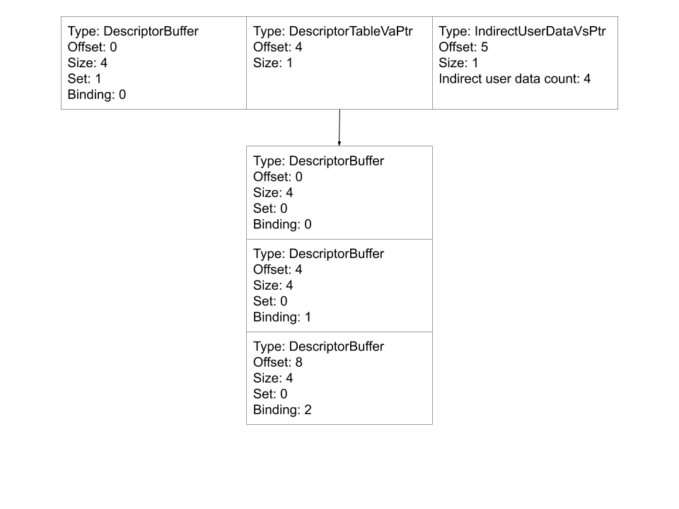

# Unlinked Shaders And Relocatable Shader Elf

# INTRODUCTION

Unlinked and relocatable shaders were designed with the intent of allowing
offline compilation of shaders that will be linked together during pipeline
creation. Compiling shaders offline means that the they can be compiled without
running the Vulkan application. The shaders will also be compiled individually.
This is advantageous because it creates new ways in which a cache can work. All
of the shader in an application can be compiled ahead of running the
applications to create a cache that will have good coverage even on the first
run. If a cache contains only unlinked shaders, the size of the cache can be
smaller. If there is no persistent cache, then compile time while running the
application will decrease because each shader is compiled once instead of once
per pipeline in which it is used.

# Unlinked shaders vs relocatable shaders

The two concepts are similar, but there is a minor, and important, distinction.
An unlinked shader is an LGC concept. LGC will generate an unlinked shader when
[`m_unlinked`](../llpc/context/llpcPipelineContext.h) in the pipeline context is
set. When possible, LGC will generate code that can be linked with other
unlinked shaders and the pipeline state to create the pipeline. The link step is
supposed to be relatively fast, and it is implemented in the `ElfLinkerImpl`
class in [ElfLinker.cpp](../lgc/elfLinker/ElfLinker.cpp).

A relocatable shader is an LLPC concept. The flag
[`enableRelocatableShaderElf`](../include/vkgcDefs.h) in the pipeline options
causes LLPC to use relocatable shaders when building the pipeline. When building
with relocatable shaders, LLPC will create a new pipeline state object for each
shader, stripping out as much as it can from the pipeline state. The new
pipeline is passed to LGC, where it will be compiled as an unlinked shader. LLPC
will then link all of those unlinked shaders together to create the pipeline.

The key difference is that unlinked shaders are built with whatever information
they have while relocatable shaders remove anything that can be handled at link
time. For example, if LGC is asked to compile an unlinked shader and the
pipeline state contains the user data nodes, then relocations will not be added
for the descriptor loads. However, if LLPC is asked to compile a pipeline using
relocatable shaders, the user data nodes will be present. LLPC will not pass
that information to LGC when compiling the unlinked shaders, and relocations
will be used.

# Strategies for handling missing pipeline state

## Relocations

[Relocations in elf files](https://refspecs.linuxbase.org/elf/gabi4+/ch4.reloc.html)
are the standard way to fill in missing information that is only available when
linking object files. Relocations are often used to represent the address of a
symbol to be accessed. Once the address of the symbol has been resolved, the
linker can fill in the value. Unlinked shaders will create relocations for the
absolute address of special symbols. These special symbols will not be given an
actual address to be used, but the relocation will be replaced with a value the
symbol represents. The value for a relocation is obtained from
[`RelocHandler::getValue`](../lgc/elfLinker/RelocHandler.cpp)

One example is the descriptor offset relocation. The symbol will have a name of
the form `doff_<d>_<b>_<t>`, where `<d>` is the descriptor set and `<b>` is the
binding of the descriptor that we are interested in. The type of the descriptor
is given by `<t>`. For example, a relocation asking for the absolute address of
`doff_2_1_s` will be replaced by the offset of the sampler (`s`) in descriptor
set 2 and binding 1.

This mechanism can be used to replace any 32-bit value that needs to appear in
the `.text` section of the unlinked shader. The current list of the special
symbols to which relocations can be applied can be found in
[AbiUnlinked.h](../lgc/include/lgc/state/AbiUnlinked.h).

## PAL metadata merging

The PAL metadata contains information that PAL uses to run the shader. Some of
the entries are closely tied to the generated code. For example, the register
counts must correspond to the number of registers actually used by the shaders.
These are often handled by merging the values from multiple unlinked shaders in
a reasonable way. For example, the register count entries will take the maximum
value from all of the unlinked shaders. Some other values are bitfields where a
bit is set if a feature is used. These are merged by taking the bitwise-or of
the values. The code that merges the PAL metadata can be found in
[PalMetadata.cpp](../lgc/state/PalMetadata.cpp) in the function
`PalMetadata::mergeFromBlob`.

## PAL metadata finalization

PAL metadata finalization is done after linking unlinked shaders. During
finalization, metadata entries that depend only on the pipeline state and not on
the actual shader code can be set. The `depthClipEnabled` field is one example.
This entry is set by copying the value of the corresponding entry in the
pipeline state. The actual shader code does not matter. These entries must not
be present or set to 0 in unlinked shaders. This removes the dependency of
unlinked shaders on those parts of the pipeline state.

## Epilogues and prologues

Some changes to the text section are too large to be handled by relocations. The
two main examples are the vertex attribute input formats and the color export
formats. These are handled by generating a prologue or epilogue for the unlinked
shaders. The prologue and epilogue are also referred to as glue shaders, and are
implemented by extending the `GlueShader` class in
[GlueShader.h](../lgc/elfLinker/GlueShader.h).

When generating an unlinked vertex shader, the entry point will have the name
`_amdgpu_vs_main_fetchless`. The inputs to this shader will be all of the
regular inputs to a vertex shader plus all of the vertex input attributes in
registers. The PAL metadata will contain a table called `.vertexInputs` that
will pass along information from the original llvm-ir that would otherwise be
lost, but is needed to load the vertex inputs correctly. When linking, a
prologue is prepended to the unlinked vertex shader that uses the pipeline state
and the `.vertexInputs` metadata to load all of the vertex input attributes into
registers. See the `FetchShader` class in
[GlueShader.cpp](../lgc/elfLinker/GlueShader.cpp) for the generation of the
prologue. To see how the unlinked shader handles vertex inputs see the
`LowerVertexFetch` pass in [VertexFetch.cpp](../lgc/patch/VertexFetch.cpp).

A fragment shader will require a epilogue to export its outputs. The unlinked
fragment shader will have the standard name for the fragment shader. Instead of
exporting the outputs, they are left in registers at the end of the shader,
where there is no `s_endpgm` instruction. Extra information is added to the PAL
metadata in the `.colorExport` table. During linking this table and the pipeline
state are used to generate all of the color export instructions and they are
appended to the end of the unlinked shader. See the `ColorExportShader` class in
[GlueShader.cpp](../lgc/elfLinker/GlueShader.cpp) for the generation of the
epilogue. To see how the unlinked shader handles color export see the
`LowerFragColorExport` pass in
[FragColorExport.cpp](../lgc/patch/FragColorExport.cpp).

These epilogues and prologues mean that unlinked shaders do not have to depend
on the format of the vertex input attributes and color exports.

## User data nodes

Consider the following example for the user data nodes:

This is the way the user data nodes are presented to the compiler. Across the
top are the three "top-level" nodes. They are considered the top because the can
be accessed directly. On the other hand, to access the descriptor for say
descriptor set 0 and binding 2, the DescriptorTableVaPtr must be loaded first.

Buffer descriptors that are placed in the top-level are called "dynamic
descriptors", and they are used to implement the feature where the application
can modify the start offset of buffer without rebuilding the pipeline state.

Suppose the compiler is generating code to access descriptor set 1 at binding 0
in a standard compile, where the user data nodes are available. Because it is a
top-level node, the compiler will try to find an input register to hold the
descriptor. Say it finds `s3`, and it is compiling the vertex shader. Then in
the PAL metadata the entry `SPI_SHADER_USER_DATA_VS_3` will be assigned the
offset of the descriptor, which is `0` in this case. Then that descriptor will
be available in a register. The register in which the descriptor will be
available depends on whether or not a gfx9+ merged shader is used. It could be
`s3` or `s11`. Note that the only resource descriptor that can be in the top
level are buffer descriptors.

Now suppose that the compiler could not find an input register. Then the
resource descriptor will be spilled. That is, it will be stored in memory. One
of the input registers will be the address of the spill table. The descriptor is
loaded at the given offset in the spill table.

Now suppose the compiler must generate code to access descriptor 0 at binding 1
in a standard compile, where the user data nodes are available. The compiler
will first have to generate code to load the DescriptorTableVaPtr. This is
similar to loading descriptor set 1 at binding 0. Then the offset of the
descriptor is added to that.

An unlinked shader compilation has to account for both a top-level descriptor or
a descriptor in a descriptor table. An example can be found in the
[buffer descriptor load test](../llpc/test/shaderdb/relocatable_shaders/DescBufferReloc.vert).

Note that for the top-level case, it is assumed that the descriptor has been
spilled. The code is generated this way in
[`DescBuilder::CreateLoadBufferDesc`](../lgc/builder/DescBuilder.cpp). The case
where `node == topeNode` cannot be reached for unlinked shaders with missing
user data nodes. Then when replacing the `reloc::DescriptorUseSpillTable`
relocation in [`RelocHandler::getValue`](../lgc/elfLinker/RelocHandler.cpp), the
descriptor is spilled if it is a top-level node.

Also note that it reserves two input registers, one of which is linked to
descriptor set 0. That register entry does not contain an offset into user data
nodes as PAL expected. During the link step, the value will be replaced with the
offset of the descriptor table that contains descriptor set 0. This happens in
[`PalMetadata::fixUpRegisters`](../lgc/state/PalMetadata.cpp).

## Compact buffer descriptors

While building an unlinked shader, it is not possible to know if compact
buffer descriptors will be used or not. It is unclear if it would be worth
generating code general enough to work in both cases. The extra overhead would
potentially negate any gains from using compact buffer descriptors. Therefore
unlinked shaders are compiled assuming that there are no compact buffer
descriptors. If the XGL option `EnableRelocatableShaders` is true, then the
driver will not use compact buffer descriptors.  Compact buffer descriptors
can only ever be top-level nodes.

## Immutable Samplers

An unlinked shader compilation where the user data nodes are not available
cannot tell if a descriptor for a sampler is actually an "immutable value", so
the code will be generated the same way it is for any other descriptor. This
means that pipelines with immutable samplers cannot be compiled using
relocatable shader.

## Examples

The
[relocatable shader test directory](../llpc/test/shaderdb/relocatable_shaders)
contains sample pipelines that use relocatable shaders.

# Performance considerations

Naturally, using relocatable shaders will reduce the quality of the code that is
generated because the code has to be more general. It is possible that this will
affect performance, but this will not be debilitating. This should be taken into
consideration when deciding to use relocatable shaders.

Here is a list of known reasons for potential slowdowns in relocatable shaders:

-   Vertex shader prologues: All vertex attributes will have to be in registers
    at the same time for them to be passed to the body of the shader. This could
    increase register usage. This to be a bigger problem for smaller shader that
    use fewer registers.

-   Unused outputs: When compiling a whole pipeline the compiler can look at the
    fragment shader to identify vertex shader outputs that are unused. Those
    exports and the code computing the them can be removed. This is not done
    with unlinked shader because the fragment shader is unavailable when
    compiling the vertex shader.

-   Immediate offset in loads: When loading descriptors, the `s_load_dword`
    instruction that is used can use an immediate offset as long at it is less
    than 20 bits. The size of the offset is unknown while compiling unlinked
    shaders, so the offset is moved into a register.

-   Loading buffer descriptors: As mentioned in the
    [user data nodes section](#user-data-nodes), the code that loads descriptors
    must be more general. The descriptor cannot be in an input register, so the
    code contains is an extra select. Also, since compact buffer descriptors
    cannot be used, the code will sometimes contain an extra load.

# Offline cache creation

In progress.
