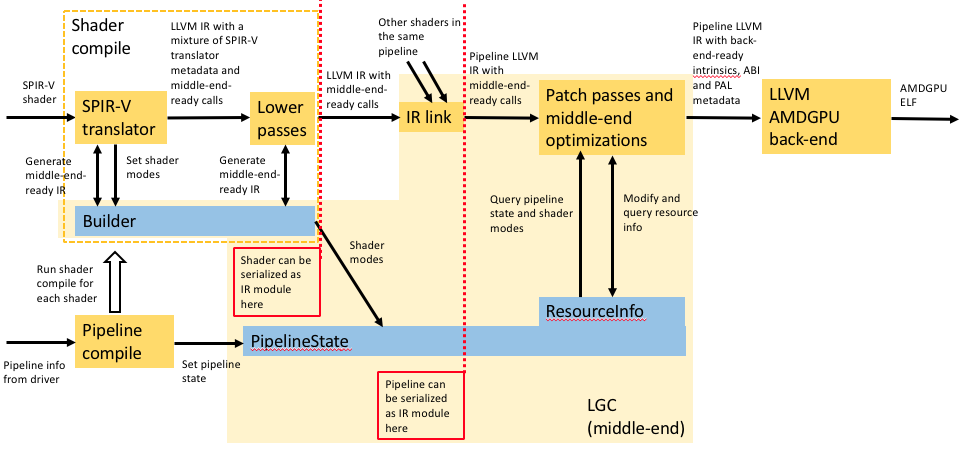

# LLPC overview

This document outlines the state of LLPC as it will be at the end of the
"middle-end interface clean-up" series of patches.

## Compilation process

LLPC builds on LLVM's existing shader compilation infrastructure for AMD GPUs to
generate code objects compatible with PAL's pipeline ABI.

The LLPC compilation process consists of three phases:
* front-end;
* middle-end (LGC);
* back-end (LLVM AMDGPU back-end).

The diagram below gives an overview of the compilation process. Yellow boxes are
a part of the processing; blue boxes are objects. For simplicity, this diagram
does not show BuilderReplayer.

### Front-end

* Translate the input SPIR-V to LLVM IR suitable for LGC.
* Run some "lowering" passes to help with that transformation.
* This phase calls the LGC (middle-end) interface to help with:
  - building LLVM IR;
  - setting state;
  - linking the individual shader IR modules into a single pipeline IR module.
* All the SPIR-V and Vulkan specific handling is within the front-end.

The SPIR-V translator is based on the Khronos SPIR-V-to-LLVM translator.

After this, when using LGC's Builder in its BuilderRecorder mode, as LLPC does, the
pipeline IR module contains calls to `llpc.call.*` functions that record the Builder
methods used by the front-end. The IR module also contains metadata representing the
pipeline state.

### Middle-end (LGC)

See
[LGC (LLPC middle-end) overview](LgcOverview.md)
for more details.

* In BuilderRecorder mode, run the BuilderReplayer pass to lower the `llpc.call.*` calls
  into actual IR, and read the pipeline state metadata.
* Perform further lowering on the LLVM IR to obtain LLVM IR with `llvm.amdgcn.*` intrinsics
  understood by the AMDGPU back-end, and the PAL metadata needed by the back-end to
  add to the ELF. Changes to make the IR conform to the PAL ABI include:
  - merging shaders in a target-specific way (LS-HS and ES-GS merging on GFX9+; NGG on
    GFX10+);
  - set up input arguments to receive SGPRs and VGPRs at wave dispatch;
  - set up PAL metadata registers appropriately.
* Run middle-end optimizations, most of which are standard LLVM ones.
* All the processing specific to particular GPUs is in here and the back-end.

### Back-end (LLVM AMDGPU back-end)

* All the usual back-end transformations (instruction selection, control-flow lowering
  for SIMD, scheduling, register allocation, ISA emission).

The result is an ELF that is PAL ABI compliant.

## Pipeline and shader caching

TODO: Outline of how the rest of pipeline and shader caching works in the front-end.

### Partial pipeline caching

There is a facility for caching part of a graphics pipeline. Where the whole pipeline missed
the cache, this works by dividing the pipeline into the vertex-processing part (all shaders
except FS), and the fragment-processing part (the FS), in the hope that one or the other part
has been used in a previous pipeline.

The hash used for the cache needs to include information on how final-vertex-stage outputs
(for a vertex-processing part) or fragment shader inputs (for an FS) are mapped. This mapping
is part of the middle-end. When calling the middle-end with `Pipeline::Generate`, the front-end
passes it a `CheckShaderCacheFunc` lambda. Once it has done the input/output mapping, the
middle-end calls this lambda back with per-shader-stage hashes of input/output mapping, allowing
the front-end to decide whether it has a cache hit and does not need to compile one or other of
the two parts of the pipeline. If it has a cache hit, it returns the shader stage mask with the
shader stages from the cache hit part zeroed out, so that part is not compiled any further.

The result of that is still an ELF in the normal way. The front-end then combines the ELF it found
in the cache with the ELF from this compile.

