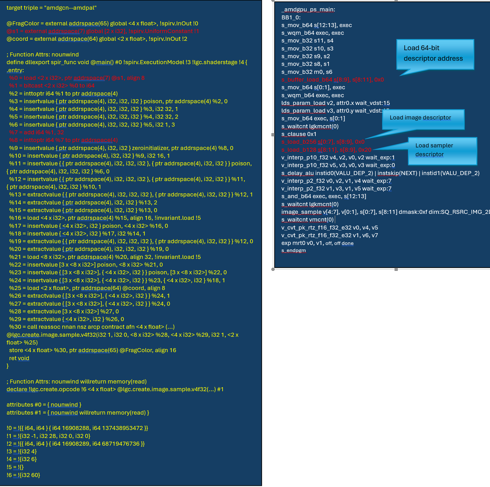

# Support OpenGL bindless texture in LLPC

## Introduction
[Bindless texture extension](http://www.opengl.org/registry/specs/ARB/bindless_texture.txt) allows OpenGL applications to access texture objects in shaders without first binding each texture to one of a limited number of texture image units.  Using this extension, an application can query a 64-bit unsigned integer texture handle for each texture that it wants to access and then use that handle directly in GLSL or assembly-based shaders.  The ability to access textures without having to bind and/or re-bind them can significantly reduce the amount of API calls and internal GL driver overhead which needed to manage resource bindings.

### The following pseudo code shows the differences between bound texture and bindless texture:
1). Bound texture
``` c++
#version 450
layout(location = 0) in vec2 vs_texCoord;
layout(location = 0) uniform sampler2D tex0;
void main()
{
    gl_FragColor = texture(tex0, vs_texCoord);
}
// Pseudo code for API calls
// Create texture object, bind the object to given target, upload the texture data
glGenTextures(1, &tex);
glBindTexture(GL_TEXTURE_2D, tex);
glTexImage2D(GL_TEXTURE_2D,0,GL_RGBA,16,16,0,GL_RGBA,GL_UNSIGNED_BYTE, texture);
…
glUseProgram(po);

// Set the texture unit
int location = glGetUniformLocation(po, "tex0");
glUniform1i(location, 0);
…
glDrawElements(GL_TRIANGLES, 12, GL_UNSIGNED_INT, 0);

```

2). Bindless texture
``` c++
#version 450
#extension GL_ARB_bindless_texture : enable
layout(location = 0) in vec2 vs_texCoord;
layout(bindless_sampler) uniform sampler2D tex0;
void main()
{
    gl_FragColor = texture(tex0, vs_texCoord);
}

// Pseudo code for API calls

// Create texture object, bind the object to given target, upload the texture data
glGenTextures(1, &tex);
glBindTexture(GL_TEXTURE_2D, tex);
glTexImage2D(GL_TEXTURE_2D,0,GL_RGBA,16,16,0,GL_RGBA,GL_UNSIGNED_BYTE, texture);

// To access texture or image resources using handles, the handles must first be made resident.

GLuint64 texHandle = glGetTextureHandleARB(tex);
glMakeTextureHandleResidentARB(texHandle);

glUseProgram(po);

// Upload texture handle by default uniform
int location = glGetUniformLocation(po, "tex0");
glUniformHandleui64ARB(location, texHandle);
…
glDrawElements(GL_TRIANGLES, 12, GL_UNSIGNED_INT, 0);

```
### Changes in GLSL

This extension adds no new data types to GLSL. Instead, it uses existing sampler and image data types and allows them to be populated with texture and image handles. sampler and image types may be used as shader inputs/outputs, temporary variables, uniform block members, buffer members and structure members and may be assigned to by shader code. Constructors are provided to convert unsigned integer values to and from sampler and image data types. For example, the following shader code are valid for bindless textures, but will cause compile-time errors for bound textures:

- **Declare bindless texture/image as vertex shader input:**

Currently OGLP driver doesn’t support bindless handle as VS input, as this feature depends on the extension `NV_vertex_attrib_integer_64bit`, the extension is not supported in our driver.
``` glsl
#version 450
#extension GL_ARB_bindless_texture : enable
layout(location = 0) in vec4 pos;
layout(location = 0) out vec4 vsColor;
layout(location = 1) in sampler2D tex;
void main() {
     gl_Position = pos;
     vsColor = texture(tex, vec2(0.0));
}

```
-  **Declare bindless texture/image as interface symbols:**
``` glsl
// Vertex shader
#version 450
#extension GL_ARB_bindless_texture : enable
layout(location = 0) in vec4 pos;
layout(location = 0) out sampler2D vsTex;
layout(bindless_sampler) uniform sampler2D tex;
void main(){
    gl_Position = pos;
    vsTex = tex;   // Pass texture handle to fragment shader
}
```

``` glsl
// Fragment shader
#version 450
#extension GL_ARB_bindless_texture : enable
layout(location = 0) in sampler2D fsTex;
layout(location = 0) out vec4  fragColor;
void main() {
     fragColor = texture(fsTex, vec2(0.0f));
}

```
- **Declare bindless texture/image as uniform block member:**
``` glsl
#version 450
#extension GL_ARB_bindless_texture : enable
layout(bindless_sampler, std140, binding = 0) uniform ubo {
    sampler2D tex;
};
layout(location = 0) out vec4 fragColor;
void main() {
     fragColor = texture(tex, vec2(0.0f));
}

```
- **Declare bindless texture/image as shader storage block member:**
``` glsl
#version 450
#extension GL_ARB_bindless_texture : enable
layout(bindless_sampler, std430, binding = 0) buffer ssbo {
    sampler2D tex;
};
layout(location = 0) out vec4  fragColor;
void main() {
     fragColor = texture(tex, vec2(0.0f));
}

```

- **Declare bindless texture/image as a temp variable:**
``` glsl
#version 450
#extension GL_ARB_bindless_texture : enable
layout(bindless_sampler) uniform sampler2D tex;
layout(location = 0) out vec4  fragColor;
void main() {
     sampler2D tempTex = tex;
     fragColor = texture(tempTex, vec2(0.0f));
}

```

Besides the bindless texture/image handle can be declared as samplerXX type, the extension ARB_bindless_texture also allows to use uvec2 to declare a 64bit texture/image handle, if we use uvec2 to declare a texture/image handle, we must call an explicit constructor to do type conversion before calling texture/image functions.

``` glsl
#version 450
#extension GL_ARB_bindless_texture : enable
layout(location = 0) uniform uvec2 tex;
layout(location = 0) out vec4  fragColor;
void main() {
     fragColor = texture(samper2D(tex), vec2(0.0f));
}
```

In the following four constructors, the low 32 bits of the sampler type correspond to the .x component of the uvec2 and the high 32 bits correspond to the .y component.
``` glsl
uvec2(any sampler type)   // Converts a sampler type to a pair of 32-bit unsigned integers
any sampler type(uvec2)   // Converts a pair of 32-bit unsigned integers to a sampler type
uvec2(any image type)     // Converts an image type to a pair of 32-bit unsigned integers
any image type(uvec2)     // Converts a pair of 32-bit unsigned integers to an image type

```

Currently all the above special grammar rules and the constructors have been supported in glslang, now we will have a glance at the spirv binary, two sample cases are provided, one is texture handle is declared as sampler2D type, another case is that the texture handle is declared as uvec2 type, these two declarations are handled differently in LLPC:

1). **Declare bindless handle as sampler2D**
``` glsl
#version 450
#extension GL_ARB_bindless_texture : enable
layout(bindless_sampler) uniform sampler2D s1;
layout(location = 1) in vec2 coord;
layout(location = 0) out vec4 FragColor;

void main()
{
    FragColor = texture(s1, coord);
}

... ...
    OpSourceExtension "GL_ARB_bindless_texture"
    OpName %4 "main"
    OpName %9 "FragColor"
    OpName %13 "s1"
 ... ...
 ... ...
%10 = OpTypeImage %6 2D 0 0 0 1 Unknown
%11 = OpTypeSampledImage %10
%12 = OpTypePointer UniformConstant %11
%13 = OpVariable %12 UniformConstant
%15 = OpTypeVector %6 2
%16 = OpTypePointer Input %15
%17 = OpVariable %16 Input
%4 = OpFunction %2 None %3
%5 = OpLabel
%14 = OpLoad %11 %13
%18 = OpLoad %15 %17
%19 = OpImageSampleImplicitLod %7 %14 %18
    OpStore %9 %19
```

From the above sample case we can see if the bindless texture handle is declared as sampler2D type, the shader’s SPIR-V binary is exactly the same with the SPIR-V binary generated by a regular(bound) texture, but we need to remember that variable %13 is a 64-bit texture handle, not a sampledImage, so when the following OpLoad instruction executes : `%14 = OpLoad %11 %13`, we can’t get the image pointer, but get a 64bit texture handle instead:

2). **Declare bindless handle as uvec2**
``` glsl
#version 450
#extension GL_ARB_bindless_texture : enable
layout(location = 0) uniform uvec2 s1;
layout(location = 1) in vec2 coord;
layout(location = 0) out vec4 FragColor;

void main()
{
    FragColor = texture(sampler2D(tex), coord);
}

... ...
    OpSourceExtension "GL_ARB_bindless_texture"
    OpName %4 "main"
    OpName %9 "FragColor"
    OpName %13 "s1"
... ...
... ...
%12 = OpTypePointer UniformConstant %11
%13 = OpVariable %12 UniformConstant
%15 = OpTypeImage %6 2D 0 0 0 1 Unknown
%16 = OpTypeSampledImage %15
%18 = OpTypeVector %6 2
%19 = OpTypePointer Input %18
%20 = OpVariable %19 Input
%4 = OpFunction %2 None %3
%5 = OpLabel
%14 = OpLoad %11 %13
%17 = OpBitcast %16 %14
%21 = OpLoad %18 %20
%22 = OpImageSampleImplicitLod %7 %17 %21
    OpStore %9 %22
    OpReturn
    OpFunctionEnd
```

If a bindless texture is declared as uvec2,  it behaves identically to a normal vector variable, we need to call an explicit type conversion sampler2D(tex) before calling texture functions, in SPIR-V binary we can see after the 64bit texture handle is loaded (%14 = OpLoad %11 %13), we insert a OpBitcast instruction to convert a 64bit handle to a sampledImage type variable, the next step we will see how to support above two cases in LLPC.

## Implementation in LLPC
### Interface changes

The ARB_bindless_texture extension was published in 2013, when we implemented this extension in OGLP driver there was no SPIR-V opcode or extension support it, so we had to add two flags to indicate whether the bindless texture/image are used in the program, we can get this state from glslang, when one texture/image in a shader is declared as bindless, all the textures/images in the given program will be handled as bindless mode, which can simplify our driver’s implementation, so in LLPC’s implementation we will continue to follow this way.

Two pipeline options are added to indicate whether the bindless texture or image is used, these two flags will be checked at pipeline compile-time, so that we can generate the correct LLVM IR for bindless texture.

``` c++
struct PipelineOptions {
…
  bool bindlessTextureMode;   ///< For OGL only, true if bindless textures are used
  bool bindlessImageMode;     ///< For OGL only, true if bindless images are used
};
```

### LLPC changes
Before implementation in LLPC, we need to clarify what is bindless texture/image handle is in our driver, what’s the relationship between bindless texture/image handle and the texture/image descriptor, here is the API `glGetTextureHandleARB`’s implementation in OGL driver:

``` c++
gsl::GpuMemAllocRef descMemory;
Pal::Result result = pGslContext->AcquireImmutableImgSrd(dataSize, descMemory);
*pHandle = descMemory->GetGpuVirtAddr();
```

From the above implementation we can see the bindless texture/image handle is its descriptor’s GPU memory address, which would be easy to create equivalent pointer as bound texture,  we can see the following dumped pipeline for a regular(bound) texture, in the first pass – translate SPIR-V binary to LLVM IR,  we can see the first statement is to get the texture descriptor’s pointer `%0 = call ptr addrspace(4) (...) @lgc.create.get.desc.ptr.p4(i32 1, i32 1, i64 4, i32 0)`, for bindless texture we can get the same result by converting a 64-bit handle to a pointer.

``` glsl
----------------glsl ----------------
#version 450
layout(location = 0) uniform sampler2D s1;
layout(location = 1) in vec2 coord;
layout(location = 0) out vec4 FragColor;

void main()
{
    FragColor = texture(s1, coord);
}
------------- SPIR-V -----------------
...
%10 = OpTypeImage %6 2D 0 0 0 1 Unknown
%11 = OpTypeSampledImage %10
%12 = OpTypePointer UniformConstant %11
%13 = OpVariable %12 UniformConstant
%15 = OpTypeVector %6 2
%16 = OpTypePointer Input %15
%17 = OpVariable %16 Input
%4 = OpFunction %2 None %3
%5 = OpLabel
%14 = OpLoad %11 %13
%18 = OpLoad %15 %17
%19 = OpImageSampleImplicitLod %7 %14 %18
...
*** IR Dump After LLPC translate SPIR-V binary to LLVM IR on [module] ***
  %0 = call ptr addrspace(4) (...) @lgc.create.get.desc.ptr.p4(i32 1, i32 1, i64 4, i32 0)
  %1 = call i32 (...) @lgc.create.get.desc.stride.i32(i32 1, i32 1, i64 4, i32 0)
  %2 = insertvalue { ptr addrspace(4), i32, i32, i32 } poison, ptr addrspace(4) %0, 0
  %3 = insertvalue { ptr addrspace(4), i32, i32, i32 } %2, i32 %1, 1
  %4 = insertvalue { ptr addrspace(4), i32, i32, i32 } %3, i32 32, 2
  %5 = insertvalue { ptr addrspace(4), i32, i32, i32 } %4, i32 1, 3
  %6 = call ptr addrspace(4) (...) @lgc.create.get.desc.ptr.p4(i32 2, i32 2, i64 5, i32 0)
```

The implementation of declaring bindless textures declare as a samplerXX is different from the implementation of declaring textures as uvec2 types, I will introduce the implementation for two cases in more details.

#### 1. Declare bindless texture handle as samplerXX type
If declare a bindless texture handle as samplerXX type, it will be a `OpTypeSampledImage` type variable in SPIR-V binary:
- At program link-time, when calling `Llpc::Compiler::buildShaderModuleResourceUsage()`, we need to recognize `OpTypeSampledImage` type variable as a 64-bit unsigned integer typed default uniform, so that we will not generate resource mapping node for texture, but generate a default uniform instead;
- At pipeline compile time, we only need to add two patches in spirvReader:

    1). When calls `SPIRVToLLVM::transVariable()` to translate variable `%13`, we need to force to change the variable type from `OpTypedSampledImage` to int64, so that we can generate a uniform variable’s declaration;

        ```
        %11 = OpTypeSampledImage %10
        %12 = OpTypePointer UniformConstant %11
        %13 = OpVariable %12 UniformConstant
        %15 = OpTypeVector %6 2
        %16 = OpTypePointer Input %15
        %17 = OpVariable %16 Input
        %4 = OpFunction %2 None %3
        %5 = OpLabel
        %14 = OpLoad %11 %13
        %18 = OpLoad %15 %17
        %19 = OpImageSampleImplicitLod %7 %14 %18
        ```
    2). When calling `SPIRVToLLVM::transValueWithOpcode<OpLoad>()` to load the bindless texture handle, we need to  load the imageDescPointer by the bindless handle;
The above solution works for the simple cases, but in real implementation, we found if the texture is declared as an array, multi-dimensional array, or declared as a struct member or block member, it is hard to handle the accessChain instruction, especially when translate the type of a bindless texture to a 64-bit unsigned integer. To handle the aggregate data types, we provided a new solution in Spirv-Builder:
1). Convert the OpTypeSampledImage typed variable to a uvec2 type variable;
2). before the texture function is called, insert a bitcast opCode to convert the uvec2 type handle to a sampler type variable;

The above solution can significantly simplify the implementation in LLPC, after this change, we don't need to convert the data types at At program link-time, we don't need to change the variable's type when calling SPIRVToLLVM::transVariable(), and we don't need to do any change to handle the accessChain instructions for the aggregate types, the bindless handle will be treated just as a uvec2 type variable, and handling the case that declare a bindless texture by a samplerXX type variable would be exactly same as that declare a bindless texutre by a uvec2 type.

#### 2. Declare bindless texture handle as uvec2 type
If declare a bindless texture as uniform uvec2 type, the solution would be much easier, an `OpBitcast` instruction was added by SPIR-V builder to convert a 64-bit handle to a sampler, which need to handle specially for bindless texture. As the bindless handle is a native 64-bit data type, so the result of this instruction `%14 = OpLoad %11 %13` is a 64-bit texture handle, when translate the following instruction
`%17 = OpBitcast %16 %14`
- Load 64-bit image descriptor address, then convert it to an int pointer with correct address space;
- Obtain the each descriptor’s pointer after image descriptor address is loaded, then insert all descriptors in the structure;

``` glsl
#version 450
#extension GL_ARB_bindless_texture : enable
layout(location = 0) uniform uvec2 s1;
layout(location = 1) in vec2 coord;
layout(location = 0) out vec4 FragColor;

void main()
{
    FragColor = texture(sampler2D(tex), coord);
}

...
%12 = OpTypePointer UniformConstant %11
%13 = OpVariable %12 UniformConstant
%15 = OpTypeImage %6 2D 0 0 0 1 Unknown
%16 = OpTypeSampledImage %15
%18 = OpTypeVector %6 2
%19 = OpTypePointer Input %18
%20 = OpVariable %19 Input
%4 = OpFunction %2 None %3
%5 = OpLabel
%14 = OpLoad %11 %13
%17 = OpBitcast %16 %14
%21 = OpLoad %18 %20
%22 = OpImageSampleImplicitLod %7 %17 %21
...
```

After the above change, we can see the pipeline dumps for the above shader, the pass “LLPC translate SPIR-V binary to LLVM IR”  and the ISA code dump looks as following, the cases that declare bindless textures by as uniform uvec2 type can run correctly.



From theory, any uvec2 type data can be used as a bindless texture/image handle, so we also need to consider the case that declare a uvec2 type bindless texture/image handle as shader inputs/outputs, temporary variables, uniform block members, buffer members, structure members, function parameters and function return value.

Besides above cases, we also need to consider the texture/image with multi-samples and texture/image buffers, because these types of texture/image have different resource descriptors.

## Summary

GL_ARB_bindless_texture is a big and flexible feature, we have supported this feature before(in close source compiler), so the implementation for driver and glslang can be reused, and fortunately LLPC’s architecture is very friendly for bindless texture/image‘s implementation, we can completely support this feature in LLPC's front-end. Although the above solutions are only for the simplest cases, these two cases are representative, so the implementation for other cases such as declare a bindless handle as interface symbol or block members will not demonstrate here, we will handle these cases by following above solutions.
